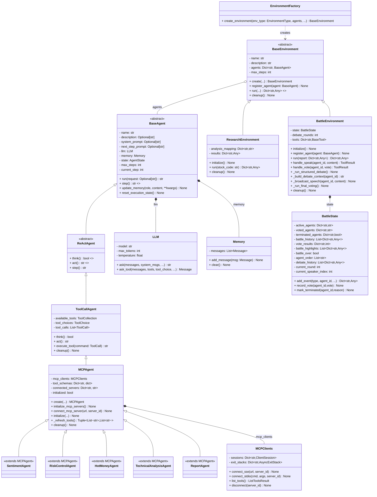
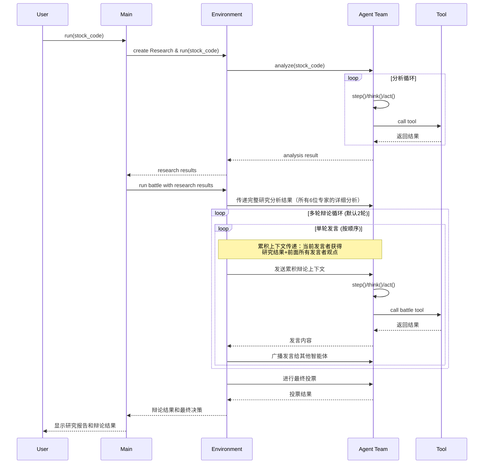

<h1 align="center">FinGenius - 金融博弈智能体</h1>

<div align="center">

</div>

<p align="center">


<a href="https://fingenius.cn"></a>
</p>

## 项目简介

FinGenius 是一个开源的智能金融分析平台，采用 **Research–Battle 双子星环境多智能体架构**，融合大语言模型与专业金融工具（基于 MCP 协议）。通过6位专业AI分析师的协作研究与结构化多轮辩论博弈，实现完整上下文传递和累积观点讨论，深度提供上市公司的多角度和多维度的分析。

> 本项目仅供学习和研究，不构成任何投资建议。投资有风险，入市需谨慎。


## APP体验(目前是开放免费早鸟体验名额)

我们诚挚邀请您体验，团队6年的心血，FinGenius移动应用：

- 特色功能：史上第一款，数学博弈魔法，革新A股体验场景。
- 移动应用：目前已上架荣耀、小米、Vivo应用市场（华为、Apple上架流程较长，正在审核中）
- 免费早鸟体验名额：扫码关注FinGenius服务号，限量前8000位。


让我们携手完善[FinGenius](https://fingenius.cn)，共同探索金融智能分析的技术前沿！🌟


## 安装指南

我们提供两种安装方式。推荐使用方式二（uv），因为它能提供更快的安装速度和更好的依赖管理。

### 方式一：使用 conda

1. 创建新的 conda 环境：

   ```bash
   conda create -n fingenius python=3.12
   conda activate fingenius
   ```

2. 克隆仓库：

   ```bash
   git clone https://github.com/huayaoyuanjin/FinGenius.git
   cd FinGenius
   ```

3. 安装依赖：

   ```bash
   pip install -r requirements.txt
   ```

### 方式二：使用 uv（推荐）

1. 安装 uv（一个快速的 Python 包管理器）：

   ```bash
   curl -LsSf https://astral.sh/uv/install.sh | sh
   ```

2. 克隆仓库：

   ```bash
   git clone https://github.com/huayaoyuanjin/FinGenius.git
   cd FinGenius
   ```

3. 创建并激活虚拟环境：

   ```bash
   uv venv --python 3.12
   source .venv/bin/activate  # Unix/macOS 系统
   # Windows 系统使用：
   # .venv\Scripts\activate
   ```

4. 安装依赖：

   ```bash
   uv pip install -r requirements.txt
   ```

## 配置说明

FinGenius 需要配置使用的 LLM API，请按以下步骤设置：

1. 在 `config` 目录创建 `config.toml` 文件（可从示例复制）：

   ```bash
   cp config/config.example.toml config/config.toml
   ```

2. 编辑 `config/config.toml` 添加 API 密钥和自定义设置：

   ```toml
   # 全局 LLM 配置
   [llm]
   model = "gpt-4o"
   base_url = "https://api.openai.com/v1"
   api_key = "sk-..."  # 替换为真实 API 密钥
   max_tokens = 4096
   temperature = 0.0

   # 可选特定 LLM 模型配置
   [llm.vision]
   model = "gpt-4o"
   base_url = "https://api.openai.com/v1"
   api_key = "sk-..."  # 替换为真实 API 密钥
   ```

## 使用方法

一行命令运行 FinGenius：

```bash
python main.py 股票代码
```

### 使用示例

```bash
# 基础分析
python main.py 000001

# 启用文本转语音
python main.py 000001 --tts

# 设置3轮辩论
python main.py 000001 --debate-rounds 3

# 自定义输出格式并保存到文件
python main.py 000001 --format json --output analysis_report.json
```

### 可选参数

- `-f, --format` - 输出格式（text 或 json）
- `-o, --output` - 将结果保存到文件
- `--tts` - 启用文本转语音播报最终结果
- `--max-steps` - 每个智能体的最大步数（默认: 3）
- `--debate-rounds` - Battle环境辩论轮数（默认: 2）

## 项目结构

FinGenius 的系统架构以分层解耦与模块化协同为核心，通过明确的接口规范，构建了一个既健壮稳定又易于扩展的智能分析平台。

**核心特性：**
- **Research环境**：多智能体协作深度分析，6位专业AI分析师并行/顺序分析（可配置）
- **Battle环境**：结构化多轮辩论系统，支持可配置轮数的顺序发言和投票决策
- **完整上下文传递**：Research所有分析结果完整传递给Battle环境的每位专家
- **累积辩论机制**：每位发言者都能获得前面所有专家的观点，形成递进式深度讨论
- **状态保持**：确保分析链路的完整性和上下文连贯性

为更直观地展示其内部结构与运作逻辑，以下类图和流程图分别从静态类组织和动态执行流程两个维度进行呈现。

### 类图



### 流程图


## 许可证

FinGenius 使用 [Apache 2.0 许可证](LICENSE)。

## 致谢

本项目基于 OpenManus 多智能体框架开发，继承了其"工具即能力"的核心理念，并将其扩展到金融分析领域，打造出专业化的金融智能体团队。

感谢 [OpenManus](https://github.com/mannaandpoem/OpenManus) 项目的启发与支持。

特别感谢 [JayTing511](https://github.com/JayTing511) 对本项目的支持与帮助。

项目顾问：[mannaandpoem](https://github.com/mannaandpoem)

我们诚邀所有AI和金融领域的开发者与研究者加入FinGenius开源社区！

> ⚠️ 免责声明：本项目仅用于教育和研究目的，专注于金融分析技术的探索，不提供投资预测或决策建议。
