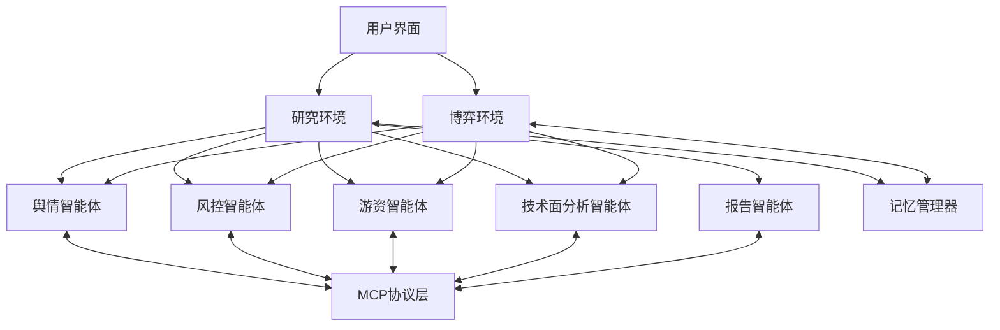

```mermaid
graph TD
    UI[用户界面]
    
    ResearchEnv[研究环境]
    BattleEnv[博弈环境]
    
    SentimentAgent[舆情智能体]
    RiskAgent[风控智能体]
    HotMoneyAgent[游资智能体]
    TechnicalAnalysisAgent[技术面分析智能体]
    ReportAgent[报告智能体]
    
    MemoryManager[记忆管理器]
    MCP[MCP协议层]

    %% 主要流程连接
    UI --> ResearchEnv
    UI --> BattleEnv
    
    %% 研究环境连接智能体
    ResearchEnv --> SentimentAgent
    ResearchEnv --> RiskAgent
    ResearchEnv --> HotMoneyAgent
    ResearchEnv --> TechnicalAnalysisAgent
    ResearchEnv --> ReportAgent

    %% 博弈环境连接智能体
    BattleEnv --> SentimentAgent
    BattleEnv --> RiskAgent
    BattleEnv --> HotMoneyAgent
    BattleEnv --> TechnicalAnalysisAgent

    %% 智能体连接MCP
    SentimentAgent <--> MCP
    RiskAgent <--> MCP
    HotMoneyAgent <--> MCP
    TechnicalAnalysisAgent <--> MCP
    ReportAgent <--> MCP

    %% 环境连接记忆
    ResearchEnv <--> MemoryManager
    BattleEnv <--> MemoryManager
```