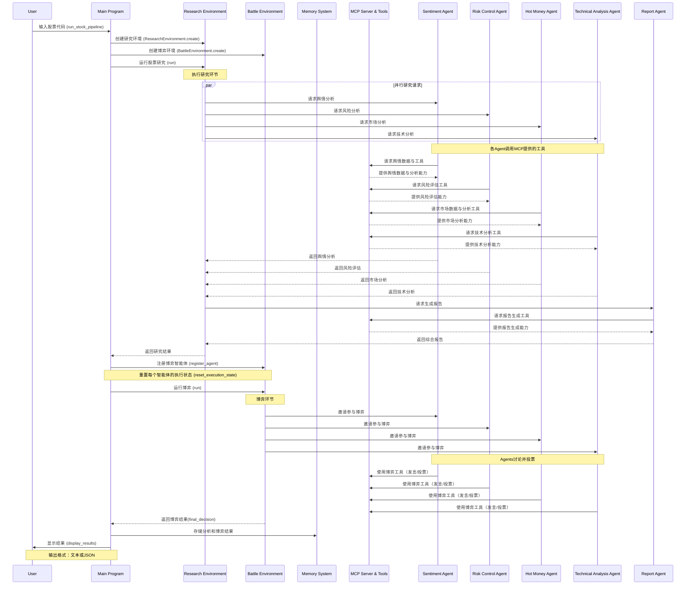

```mermaid
sequenceDiagram
    participant User
    participant Main as Main Program
    participant ResearchEnv as Research Environment
    participant BattleEnv as Battle Environment
    participant Memory as Memory System
    participant MCP as MCP Server & Tools
    participant SA as Sentiment Agent
    participant RA as Risk Control Agent
    participant HMA as Hot Money Agent
    participant TAA as Technical Analysis Agent
    participant REP as Report Agent

    User->>Main: 输入股票代码 (run_stock_pipeline)

    Main->>ResearchEnv: 创建研究环境 (ResearchEnvironment.create)
    Main->>BattleEnv: 创建博弈环境 (BattleEnvironment.create)

    Main->>ResearchEnv: 运行股票研究 (run)

    Note over ResearchEnv: 执行研究环节

    par 并行研究请求
        ResearchEnv->>SA: 请求舆情分析
        ResearchEnv->>RA: 请求风险分析
        ResearchEnv->>HMA: 请求市场分析
        ResearchEnv->>TAA: 请求技术分析
    end

    Note over SA,TAA: 各Agent调用MCP提供的工具
    SA->>MCP: 请求舆情数据与工具
    MCP-->>SA: 提供舆情数据与分析能力

    RA->>MCP: 请求风险评估工具
    MCP-->>RA: 提供风险评估能力

    HMA->>MCP: 请求市场数据与分析工具
    MCP-->>HMA: 提供市场分析能力

    TAA->>MCP: 请求技术分析工具
    MCP-->>TAA: 提供技术分析能力

    SA-->>ResearchEnv: 返回舆情分析
    RA-->>ResearchEnv: 返回风险评估
    HMA-->>ResearchEnv: 返回市场分析
    TAA-->>ResearchEnv: 返回技术分析

    ResearchEnv->>REP: 请求生成报告
    REP->>MCP: 请求报告生成工具
    MCP-->>REP: 提供报告生成能力
    REP-->>ResearchEnv: 返回综合报告

    ResearchEnv-->>Main: 返回研究结果

    Main->>BattleEnv: 注册博弈智能体 (register_agent)
    Note over Main,BattleEnv: 重置每个智能体的执行状态 (reset_execution_state)

    Main->>BattleEnv: 运行博弈 (run)

    Note over BattleEnv: 博弈环节
    BattleEnv->>SA: 邀请参与博弈
    BattleEnv->>RA: 邀请参与博弈
    BattleEnv->>HMA: 邀请参与博弈
    BattleEnv->>TAA: 邀请参与博弈

    Note over SA,TAA: Agents讨论并投票
    SA->>MCP: 使用博弈工具（发言/投票）
    RA->>MCP: 使用博弈工具（发言/投票）
    HMA->>MCP: 使用博弈工具（发言/投票）
    TAA->>MCP: 使用博弈工具（发言/投票）

    BattleEnv-->>Main: 返回博弈结果(final_decision)

    Main->>Memory: 存储分析和博弈结果

    Main->>User: 显示结果 (display_results)
    Note over Main,User: 输出格式：文本或JSON
```
